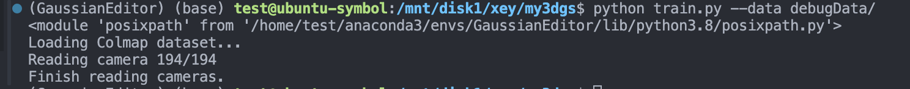

# 3DGS代码复现

原链接：[3DGS](https://github.com/graphdeco-inria/gaussian-splatting)

根据论文中的框架，可以将任务分成：

## 训练过程

- 数据读取

目前正在写Colmap数据的读取，Blender数据还没写，先把Colmap数据弄完吧

这一部分主要涉及了摄像机几何中的坐标转换，最后的数据需要经过归一化处理（NeRF++中的思路），将Colmap之后的相机和图片数据相匹配，划分出训练数据和测试数据，读取稀疏点云，为后续的训练做准备。

读取点云和创建点云参考[plyfile](https://python-plyfile.readthedocs.io/en/latest/usage.html)。

2024.4.17 完成了数据加载部分。

- 场景初始化

- 从点云构建高斯球

- 迭代训练

- 优化更新高斯球

- 渲染

- 计算损失

- 得到模型

## 渲染过程

## 计算误差

## Preliminary

### 球谐函数（SH）

参考链接：[NeRF中的球谐函数](https://blog.csdn.net/leviopku/article/details/135136978)。

球谐函数是一种球面基函数，关于基函数的定义可以参考下面的例子：

> 比如多项式基函数：
>
> $y_0 = 1$， $y_1 = x$， $y_2 = x^2$， $y_3 = x^3$ $...$   

那么可以用上面的函数作为基，用它们来定义一个多项式函数，描述成几个基函数的加权和。这样做的本质上是一种压缩，就像一个密码本（codebook），在一组确定的基函数之下，每个函数只需要存储它们的加权参数即可。除了直角坐标系中，基函数可以定义在极坐标或者球面坐标中。

球谐函数一种定义在球面坐标的基函数。在3dgs中，球谐函数中的$l=3$，有16个基函数，再加上有RGB三个通道，因此需要16*3=48个参数来表示颜色。

在实现时，一开始先从0阶的球谐函数开始优化，每1000次迭代就会提升一次阶数，这样做的原因是球谐函数对角度信息缺乏很敏感，在刚开始训练时，辐射场还没有较好的几何形状，球谐函数表示信息很多是错误的，因此选择这样的做法。参考原文的section7.1。

### 摄像机几何

对于摄像机参数读取部分，可以参考[相机位姿估计相关代码解读](http://www.yindaheng98.top/%E5%9B%BE%E5%BD%A2%E5%AD%A6/%E7%9B%B8%E6%9C%BA%E4%BB%A3%E7%A0%81.html#recenter-poses)。

- 摄像机内外参数

这部分参考了[一文带你搞懂相机内参外参(Intrinsics & Extrinsics)
](https://zhuanlan.zhihu.com/p/389653208)

内参数的含义是一个摄像机捕捉世界中的物体并将其投影到自己的像平面中的变换矩阵，这个一般在相机出厂时就已经设置好了。它是将空间点从相机坐标系转换到像素坐标系。相机内参是一个矩阵，其形式为

$$
\begin{pmatrix}
f_x & 0 & c_x \\
0 & f_y & c_y \\
0 & 0 & 1 \\
\end{pmatrix}
$$

外参数的含义是将空间点从世界坐标系转换到相机坐标系中的转换矩阵和向量，其形式为

$$
\begin{pmatrix}
R & t \\
0 & 1 \\
\end{pmatrix}
$$

计算公式：$P = RP_w + t$

其中$R$、$t$分别表示旋转矩阵和平移向量，在代码中存在于`cam_extrinsics`中的`qvce`（旋转四元数，需要经过数学变换）和`tvec`中。

摄像机模型可以分为：

- SIMPLE_PINHOLE：简单针孔模型，具有3个参数。

- PINHOLE：针孔模型，具有4个参数。

- SIMPLE_RADIAL：简单径向畸变模型，具有4个参数。

- RADIAL：径向畸变模型，具有5个参数。

- OPENCV：OpenCV模型，具有8个参数。

- OPENCV_FISHEYE：OpenCV鱼眼模型，具有8个参数。

- FULL_OPENCV：完整的OpenCV模型，具有12个参数。

- FOV：视场角模型，具有5个参数。

- SIMPLE_RADIAL_FISHEYE：简单径向鱼眼模型，具有4个参数。

- RADIAL_FISHEYE：径向鱼眼模型，具有5个参数。

- THIN_PRISM_FISHEYE：薄棱镜鱼眼模型，具有12个参数。

Colmap仅能处理前面两种模型。

晚安😴